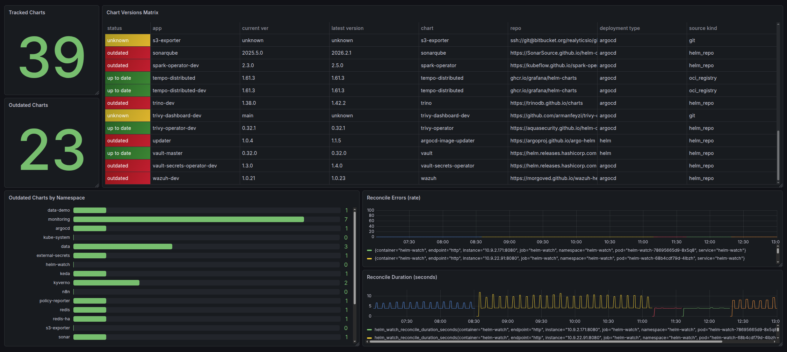

# Helm Watch

Helm Watch is a Kubernetes observability service that gives teams real-time visibility into Helm chart version drift across deployment methods.

It discovers Helm-based workloads in-cluster, resolves current deployed versions, compares them with upstream chart versions, and exposes the result as Prometheus metrics for Grafana dashboards and alerts.

## Grafana Dashboard



## Why Helm Watch

In most clusters, Helm charts are deployed through different paths:

- Argo CD (GitOps)
- Helm CLI/manual workflows
- Terraform Helm provider

This fragmentation makes it hard to answer simple but critical questions:

- What chart versions are currently running?
- Which workloads are outdated?
- Where are upgrade risks or security lag accumulating?

Helm Watch addresses this with a single, cluster-side source of truth.

## Core Capabilities (MVP)

- Discover Helm-based workloads from:
  - Argo CD `Application` resources
  - Helm release storage objects (`Secret`/`ConfigMap`, `owner=helm`)
- Normalize workload metadata across sources
- Resolve latest chart versions from upstream Helm repositories
- Compare `current` vs `latest` versions
- Export Prometheus metrics at `/metrics`

## Out of Scope (MVP)

- Automatic upgrades
- Git repository write-back
- Built-in UI (Grafana is the UI)
- Helm deployment lifecycle management

## High-Level Architecture

```text
Kubernetes Cluster
     ↓
[Helm Watch Service]
     ├─ Discovery Layer
     ├─ Metadata Normalization
     ├─ Repository Resolver + Cache
     ├─ Version Comparison Engine
     └─ Metrics Exporter (/metrics)
     ↓
Prometheus
     ↓
Grafana / Alerting
```

## Current Project Status

Implemented so far:

- Service runtime skeleton
- Health and metrics endpoints
- Canonical internal data contracts
- Discovery manager with periodic reconcile loop
- Argo CD + Helm release source adapters
- Repository resolver with cache and stale-on-error behavior
- Version comparison engine
- Core chart metrics pipeline
- Deploy directory with Kubernetes manifests and Helm chart
- GitHub Actions CI producing binaries and container image artifacts

Planned next:

- Repository resolver (`index.yaml` fetch + cache)
- Version comparison engine
- Full metrics contract and dashboards

## Example Metrics

```text
helm_chart_info{app="alloy",namespace="monitoring",chart="alloy",repo="https://grafana.github.io/helm-charts",current_version="1.6.0",latest_version="1.8.2",deployment_type="argocd",status="outdated"} 1
helm_chart_outdated{app="alloy",namespace="monitoring",chart="alloy"} 1
helm_chart_version_lag{app="alloy",namespace="monitoring",chart="alloy"} 202
```

## Run Locally

Prerequisites:

- Go 1.22+ (or compatible recent version)
- Access to a Kubernetes cluster

Run:

```bash
go run ./cmd/helm-watch
```

Useful environment variables:

- `HELM_WATCH_HTTP_ADDR` (default `:8080`)
- `HELM_WATCH_HTTP_READ_TIMEOUT` (default `10s`)
- `HELM_WATCH_HTTP_WRITE_TIMEOUT` (default `10s`)
- `HELM_WATCH_SHUTDOWN_TIMEOUT` (default `10s`)
- `HELM_WATCH_RECONCILE_EVERY` (default `1h`)
- `HELM_WATCH_REPO_CACHE_TTL` (default `5m`)
- `HELM_WATCH_RESOLVE_WORKERS` (default `8`)
- `HELM_WATCH_REPO_OVERRIDES` (optional chart->repo mapping, format: `chart=https://repo/index,chart2=https://repo2/index`).
  Use it when the discovered `repo` is missing or wrong (for example a chart deployed via `helm install` without a recorded URL,
  or an Argo CD `Application` whose `spec.source.repoURL` points at a Git mirror instead of a Helm repo).
  Example: `vault=https://helm.releases.hashicorp.com,argocd-image-updater=https://argoproj.github.io/argo-helm`.
  OCI repos are supported too: `redis=oci://registry-1.docker.io/bitnamicharts`.
- `HELM_WATCH_KUBECONFIG` (optional fallback for local runs)
- `HELM_WATCH_LOG_LEVEL` (default `info`)

Endpoints:

- `GET /healthz`
- `GET /metrics`

## When `latest_version` shows `unknown`

Helm Watch resolves upstream versions only when a chart's `repo` is something it can query.
Common cases and how to fix them:

| Source                                                | Resolves automatically?                | How to fix                                                                                                                  |
| ----------------------------------------------------- | -------------------------------------- | --------------------------------------------------------------------------------------------------------------------------- |
| `helm_repo` (`https://...github.io/...`)              | Yes (fetches `index.yaml`)             | -                                                                                                                           |
| `oci_registry` (`ghcr.io/...`, `registry-1.docker.io/...`) | Yes (Docker Registry v2 API, paginated) | -                                                                                                                           |
| `git` (Argo CD or Helm release pointing at a Git repo) | No                                     | Add an override mapping the chart name to the real Helm/OCI repo. Overrides take precedence over `git` sources.             |
| Helm release without a stored repo URL                | No                                     | Add an override mapping the chart name to the upstream repo.                                                                |
| Workloads with `current_version=main` or other non-semver | No                                     | These are GitOps-rendered manifests with no upstream chart version to compare against. Status will stay `unknown`.          |

Override example:

```bash
HELM_WATCH_REPO_OVERRIDES="vault=https://helm.releases.hashicorp.com,argocd-image-updater=https://argoproj.github.io/argo-helm,redis=oci://registry-1.docker.io/bitnamicharts"
```

In Helm:

```yaml
config:
  repoOverrides:
    vault: https://helm.releases.hashicorp.com
    argocd-image-updater: https://argoproj.github.io/argo-helm
    redis: oci://registry-1.docker.io/bitnamicharts
```

(See `deploy/helm-watch/values.yaml` for the full structure.)

## Deploy to Kubernetes

Two deployment methods are included:

- Raw manifests: `deploy/k8s/`
- Helm chart: `deploy/helm-watch/`
- Monitoring bootstrap: `deploy/monitoring/`

See `deploy/README.md` for commands.

## CI Artifacts

GitHub Actions workflow at `.github/workflows/ci.yml`:

- runs tests
- lints Helm chart
- builds Linux binaries
- builds Docker image
- uploads artifacts (binaries + Docker image tar)

Tag-based release workflow at `.github/workflows/release.yml`:

- runs tests on `v*` tags
- builds Linux release binaries (`amd64`, `arm64`)
- lints and packages Helm chart (`.tgz`)
- pushes multi-arch image to GHCR
- creates GitHub Release and uploads binaries, checksums, and chart package

## Roadmap

- Repository resolver and caching strategy
- Version engine with robust semver handling
- Outdated and lag metrics
- Dashboard and alert templates
- Hardening for edge cases (multi-source apps, unsupported sources, partial failures)

Release verification notes are tracked in `docs/release-verification-v0.1.2.md`.

## License

Licensed under Apache License 2.0. See `LICENSE` for full terms.
